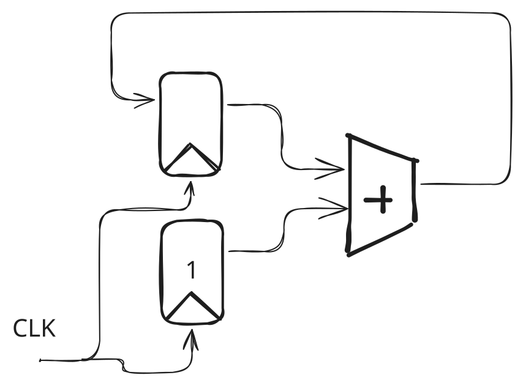
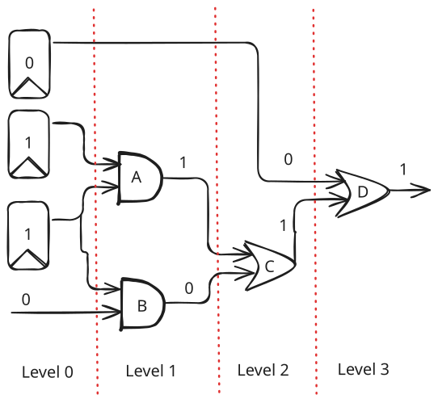
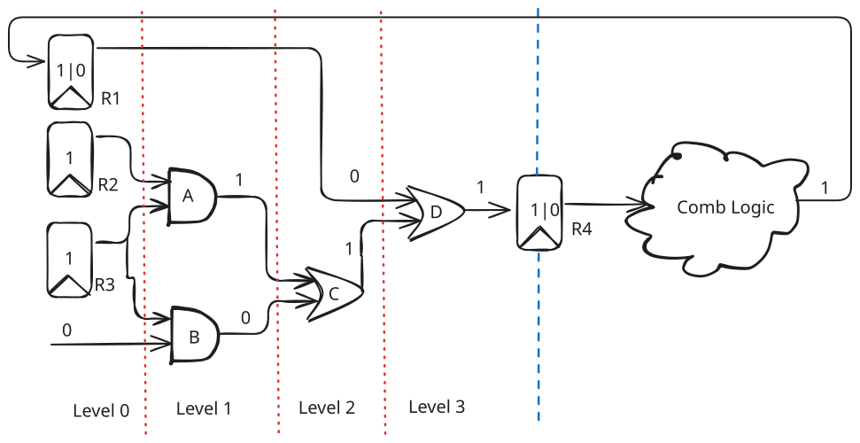
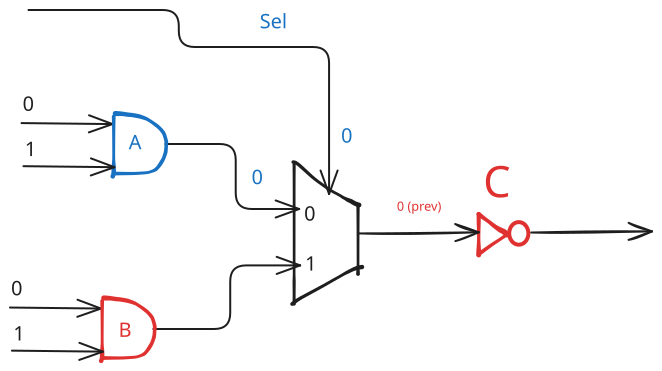

# RTL Simulation

RTL simulation is the workhorse for digital design.
Lets cover how RTL simulators like VCS or Verilator work under the hood.

## What is RTL

RTL stands for register transfer level.
In RTL, there are three components.
First, there are the registers which contains some state of the circuit for a cycle.
Next, logic (a.k.a combinational logic) is some circuitry that performs some sort of computation within a cycle.
Finally, there are the wires that carries a value of a bit from one place to another.

  

In the example, there are two registers driving the adder (combinational logic) that feeds back to a input register.
The output of the adder will be updated in the register at the next positive/negative clk edge.

---

## Statically Scheduled RTL Simulation

For the sake of simplicity, lets only consider **single clock, synchronous circuits** from now on.
Hence, I'll be omitting the clock signal in the diagrams.

### Single Level of Sequential Logic

To simplify things even further, lets consider a single level of sequential logic: registers to the outputs of the combinational logic that they are driving.
In this scenario, the circuit can be represented as a directed acyclic graph as cycles between combinational logic is prohibited in digital design.

  

The first step to simulating a single level of sequential logic is to "levelize" it (a.k.a topological sort).

- Registers and external inputs are placed at level 0
- The level of a logic element is represented by: `my_level = max(child[0].level, child[1].level, ...) + 1`
    - `Level(A) = max(0, 0) + 1`
    - `Level(C) = max(Level(A), Level(B)) + 1 = max(1, 1) + 1`
    - `Level(D) = max(Level(Reg), Level(C)) + 1 = max(0, 2) + 1`

The next step is to propagate the signals level by level.

- Level 1:
    - Output of the and gate `A` is `1`
    - Output of `B` is `0`
- Level 2:
    - Output of the or gate `C` is `1`
- Level 3:
    - Output of `D` is `1`

As you can see, if we propagate the signals level by level, we are guaranteed that we have updated the output values of all the child nodes of the current node.
Hence, we never have to worry about using stale values when executing the logic function.

### Sequential Logic with Multiple Levels

Finally, lets consider the case when there are multiple levels of sequential logic. Note that now we can have cycles in the graph as well.
However, there must be at least one register in a cycle.

  

In the first phase of the simulation, we simulate each level of sequential logic independently with each other.
For example, we simulate the logic between `R1`, `R2`, `R3` to `D`, and `R4` to the output of `Comb Logic` independently.

In the second phase, we update all the register values to its input value: `R1` will be updated from `0` to `1`, and `R4` will be updated from `0` to `1`.

This is it.
We just simulated a single cycle of the entire circuit.

---

## Event Driven RTL Simulation

Now lets look at how event-driven RTL simulation works.
In an event-driven RTL simulation framework, an event happens when the value of an element changes compared to the previous cycle.
These events are queued up in some priority queue and scheduled for execution.
Hence, we can skip evaluating parts of the circuit that stays the same with respect to the previous cycle.

  

In the above example, the first event that is evaluated is the `sel` signal.
It is evaluated to `0` and we know that we can skip (marked as red) evaluating the output of `B`.
Next, we evaluate the output of `A` (`0`) and propagate the output to the input of `C`.
If the input of `C` was `0` in the previous cycle, the downstream combinational logic including `C` does not need to be evaluated.

---

## Event Driven vs Statically Scheduled

Event driven simulation is beneficial when you can skip large parts of the circuit.
However, there is extra overhead during the runtime as it has to dynamically schedule the operations that comes next.
Furthermore, it must maintain some additional state where which you want to check for activity propagation.
Simulators like VCS, Xcelium are event driven.

On the contrary, statically scheduled simulations doesn't suffer from this runtime overhead as you are scheduling the operations during compile time.
However, since you are generating a straight line code traversing a massive graph, the CPU suffers from poor instruction cache locality and branch mispredictions.
Verilator is statically scheduled (some cycle skipping is supported though).

Of course, you can mix the two to balance the runtime scheduling overhead vs amount of computation. [^1]

[^1]: [ESSENT-Scott](https://scottbeamer.net/pubs/beamer-woset2021.pdf)
